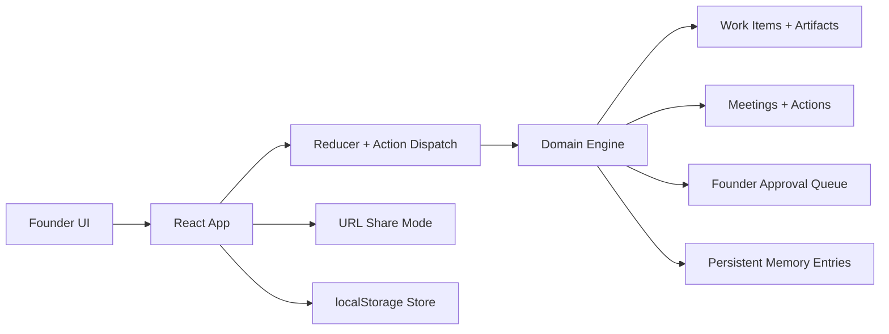

# AI Agents Boutique

A polished front-end prototype for a single-company AI operating system. The experience lets a founder run Product, Engineering, and Design agents through direct chat, structured rituals, approval gates, and persistent memory, all in a calm three-pane workspace.

## Snapshot

| Launch flow | Founder cockpit |
| --- | --- |
|  |  |

## Why this project is portfolio-worthy

- It frames AI agents as an operating model, not just a chatbot.
- It turns recurring meetings into product features with agendas, summaries, actions, and reusable memory.
- It keeps human approval explicit instead of hiding risky changes behind automation.
- It shows product thinking, interface craft, and implementation discipline in the same repo.

## Core product surfaces

- `Command deck`: founder overview with company health, queued rituals, approvals, and recent output.
- `1:1 lines`: direct founder-to-agent chat grounded in each worker's queue, blockers, and memory.
- `Ritual rooms`: facilitated meetings with searchable history and shareable read-only recaps.
- `Work loop`: execution view for work items, artifacts, approvals, and follow-up actions.
- `Context rail`: always-on operational context for upcoming rituals, approvals, open actions, and recent decisions.

## Technical highlights

- React 19 + TypeScript + Vite 8.
- Reducer-driven state model with a deterministic domain engine for agents, work, meetings, approvals, and memory.
- Shareable ritual recaps encoded into the URL so a session can be opened in read-only mode without a backend.
- Local persistence through `localStorage`, which keeps the prototype self-contained and easy to demo.
- Vitest coverage around the engine and sharing layer.
- GitHub Actions CI for `npm run check` on pushes and pull requests.

## Architecture



## Local setup

```bash
npm install
npm run dev
```

Open the local Vite server and create a company to enter the founder cockpit.

## Quality checks

```bash
npm run check
```

That runs the test suite and production build in sequence.

## Project structure

```text
.
├── .github/workflows/ci.yml
├── docs/
│   ├── assets/
│   └── case-study.md
├── src/
│   ├── components/
│   └── lib/
├── Dockerfile
├── docker-compose.yml
└── README.md
```

## Design and engineering notes

- The UI is intentionally editorial and cinematic instead of default dashboard chrome.
- The domain model is explicit enough to be extended into a real orchestration product later.
- The prototype is easy to review because the repo is clean, the setup is lightweight, and the important flows are documented.

## Deeper walkthrough

The longer product and technical breakdown lives in [docs/case-study.md](docs/case-study.md).

## License

MIT. See [LICENSE](LICENSE).
