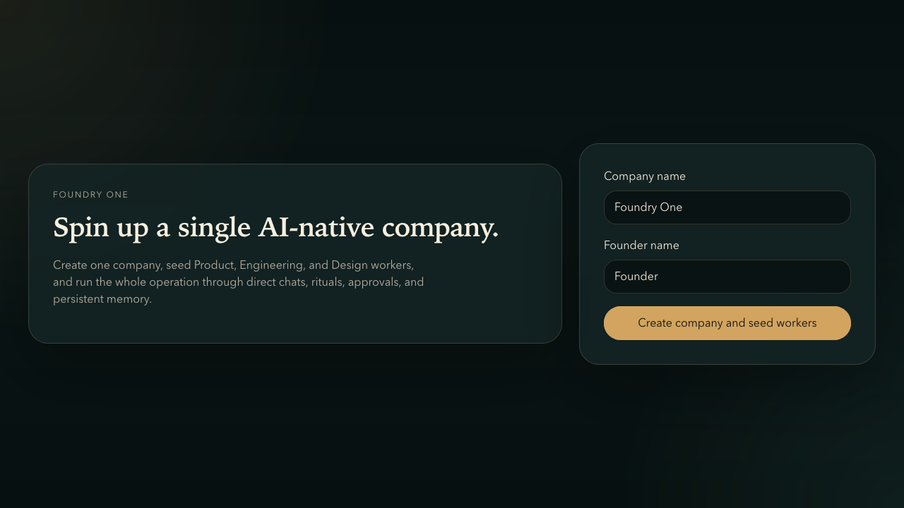
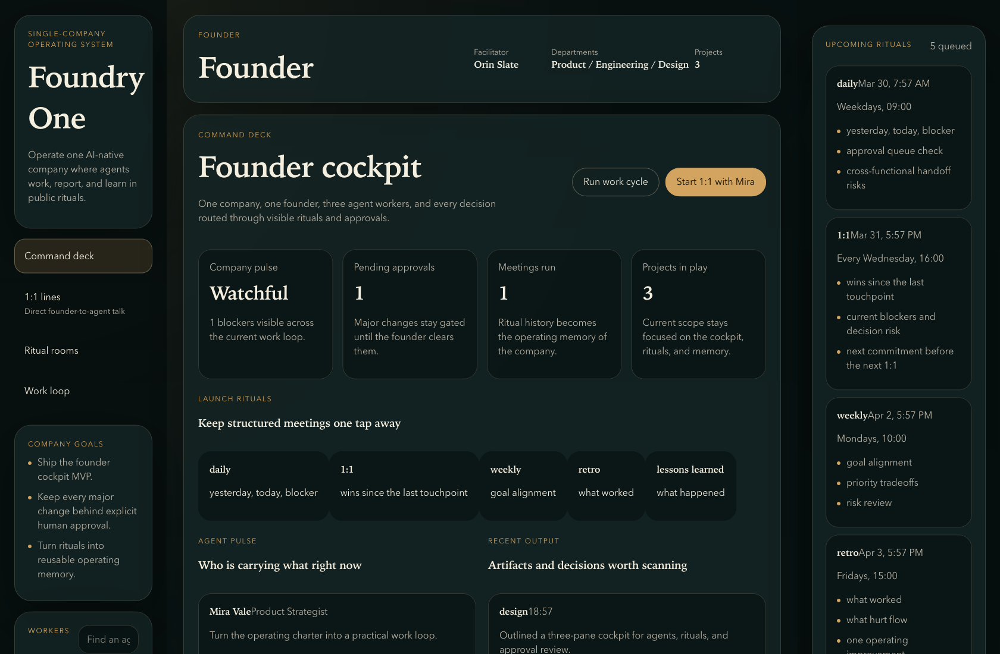
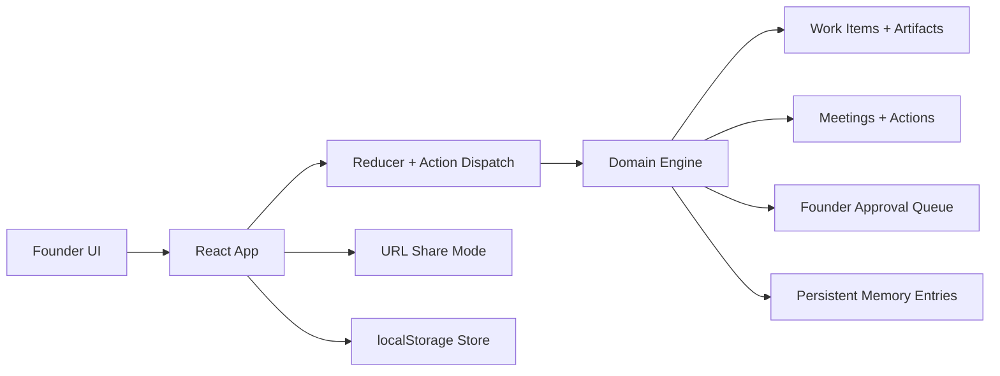

# AI Agents Boutique

A polished single-company AI operating system prototype. The experience lets a founder run Product, Engineering, and Design agents through direct chat, structured rituals, approval gates, persistent memory, and a local live-connector bridge for Codex, OpenClaw, Hermes, and the macOS Terminal.

## Snapshot

| Launch flow | Founder cockpit |
| --- | --- |
|  |  |

## Why this project is portfolio-worthy

- It frames AI agents as an operating model, not just a chatbot.
- It turns recurring meetings into product features with agendas, summaries, actions, and reusable memory.
- It keeps human approval explicit instead of hiding risky changes behind automation.
- It shows product thinking, interface craft, and implementation discipline in the same repo.

## Core product surfaces

- `Command deck`: founder overview with company health, queued rituals, approvals, and recent output.
- `1:1 lines`: direct founder-to-agent chat grounded in each worker's queue, blockers, and memory.
- `Ritual rooms`: facilitated meetings with searchable history and shareable read-only recaps.
- `Work loop`: execution view for work items, artifacts, approvals, and follow-up actions.
- `Live bridge`: local connector control surface for assigning each worker to Codex, OpenClaw, or Hermes and dispatching ritual prompts into direct runs or Terminal sessions on macOS.
- `Context rail`: always-on operational context for upcoming rituals, approvals, open actions, and recent decisions.

## Technical highlights

- React 19 + TypeScript + Vite 8.
- Reducer-driven state model with a deterministic domain engine for agents, work, meetings, approvals, and memory.
- Shareable ritual recaps encoded into the URL so a session can be opened in read-only mode without a backend.
- Local persistence through `localStorage`, which keeps the prototype self-contained and easy to demo.
- Local Node API for real connector dispatches into `codex`, configurable OpenClaw/Hermes runners, and AppleScript-based Terminal launch on macOS.
- Vitest coverage around the engine and sharing layer.
- GitHub Actions CI for `npm run check` on pushes and pull requests.

## Architecture



## Local setup

1. Install dependencies:

```bash
npm install
```

2. Optional: copy `.env.example` to `.env.local` and point `OPENCLAW_COMMAND_TEMPLATE` and `HERMES_COMMAND_TEMPLATE` at your own local wrapper scripts if you want those connectors live.

3. Start the web app and local connector API together:

```bash
npm run dev
```

Open the local app, create a company, then use `Live bridge` to assign connectors per worker and dispatch direct chats or ritual prompts.

If you want the built app plus API in one process:

```bash
npm run build
npm run start
```

## Quality checks

```bash
npm run check
```

That runs the test suite and production build in sequence.

## Project structure

```text
.
├── .github/workflows/ci.yml
├── docs/
│   ├── assets/
│   └── case-study.md
├── src/
│   ├── components/
│   └── lib/
├── Dockerfile
├── docker-compose.yml
└── README.md
```

## Design and engineering notes

- The UI is intentionally editorial and cinematic instead of default dashboard chrome.
- The domain model is explicit enough to be extended into a real orchestration product later.
- Codex works out of the box if the CLI is installed and authenticated locally. OpenClaw and Hermes are intentionally template-driven because their local runners vary more across setups.
- The prototype is easy to review because the repo is clean, the setup is lightweight, and the important flows are documented.

## Deeper walkthrough

The longer product and technical breakdown lives in [docs/case-study.md](docs/case-study.md).

## License

MIT. See [LICENSE](LICENSE).
